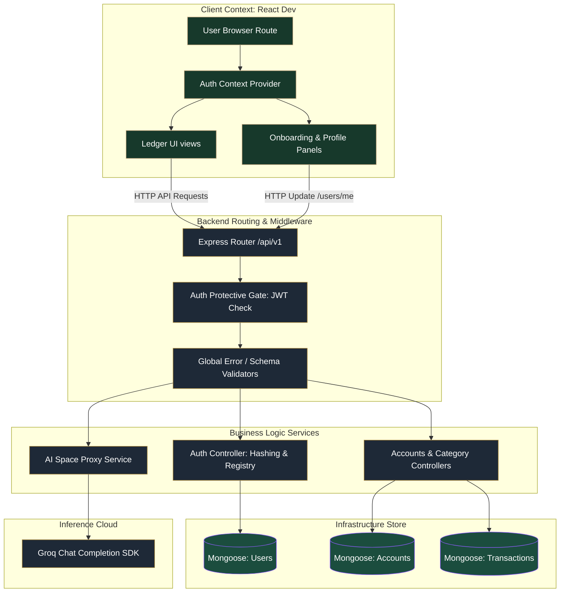
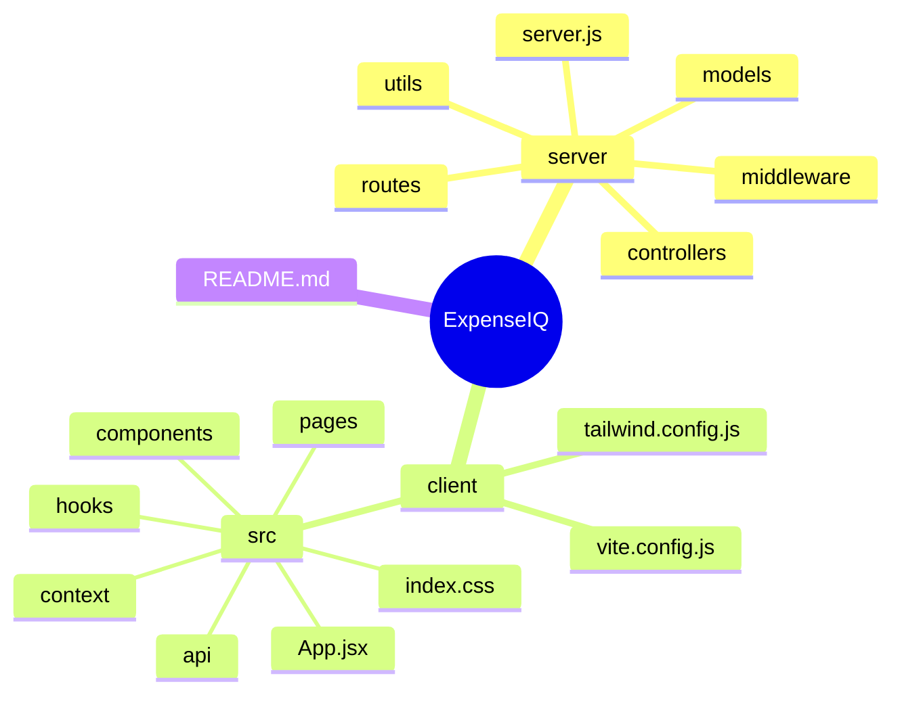
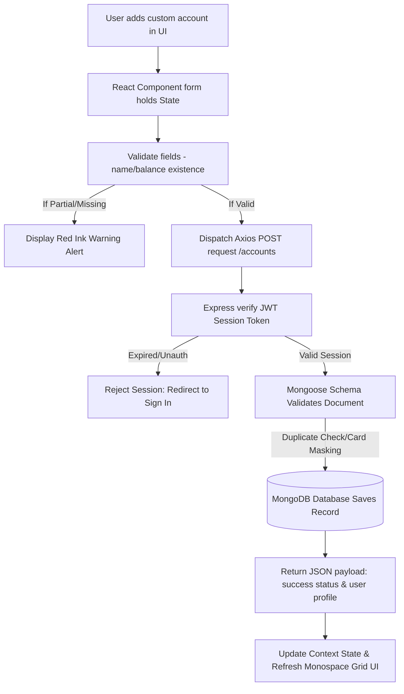
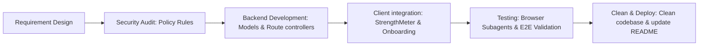

# ExpenseIQ — Autonomous MERN Stack Expense Tracker & Ledger Console

A MERN-based double-entry ledger bookkeeping system featuring smart real-time password checkers, currency-specific onboarding, and integrated AI-driven budget modeling.

---

## 📋 Table of Contents
- [Project Overview](#-project-overview)
- [Features](#-features)
- [Screenshots](#-screenshots)
- [Architecture](#-architecture)
- [Project Structure](#-project-structure)
- [Workflow](#-workflow)
- [Technology Stack](#-technology-stack)
- [Installation](#-installation)
- [Usage](#-usage)
- [Configuration](#-configuration)
- [Folder Explanation](#-folder-explanation)
- [Contribution Guide](#-contribution-guide)
- [License](#-license)
- [Author](#-author)

---

## 🔍 Project Overview

ExpenseIQ AI is a financial management platform designed under a vintage **"Ledger Book"** design system. Drawing layout cues from paper-based double-entry books, it translates raw tracking into structured financial sheets.

### Why it Exists & What it Solves
Typical expense trackers are generic, using colorful, gamified, circular progress bars and confusing tags. ExpenseIQ re-introduces the core concepts of standard engineering bookkeeping:
* **The Problem**: Lack of visibility into real category limits, fragmented bank balances database schemas, weak registration password policies, and generic AI mock systems.
* **The Solution**: An integrated double-entry register built on strict ink-based layouts, real-time client/server password strength validation metrics, currency matching (rupee `₹`), and automated category analytics.
* **Who it is for**: Developers, financial engineers, self-bookkeepers, and enthusiasts seeking an advanced, clean, and private MERN dashboard.

---

## ✨ Features

✅ **Ink Strength Security Checker**: Live 5-point password verification checklist (8+ chars, uppercase, lowercase, digit, and symbol) validated on both client interface and server controller endpoints.

✅ **Two-Step Currency-Localized Onboarding**: Initial user step configured in native Indian Rupees (`₹`) to manage baseline targets, followed by an asset registration modal.

✅ **Smart Implicit Account Loader**: Auto-resolves and validates partially completed accounts data when finishing profile registration, ensuring unsaved inputs are never lost.

✅ **Unified Double-Entry Interface**: Clean grids detailing transactional debit and credit sheets with monospace tabular tracking figures.

✅ **Telemetry Engine & Health Monitoring**: Automatic monitoring of external AI endpoint dependencies (e.g., Groq) with seamless local grace-degradation modes.

✅ **AI-Driven Budget Analyst**: Immediate financial feedback loops examining current category constraints and expenditure limits.

---

## 📸 Screenshots

 Registration Page
 

 Dashboard Page


Account Page


Income Page


BudgetTracking Page


AI Assistant Page


Profile Page


---

## 🏗️ Architecture

Flowchart detailing the client-server telemetry, middleware controllers, database persistence layer, and external integrations:



---

## 📂 Project Structure

Tree layout describing root, backend routes, React views, components state hooks, and global context scopes:



---

## 🔄 Workflow

Sequential transaction flow from initial user interaction to database mapping, and API JSON payload response:



---

## 🛠️ Development Lifecycle

Standard workflow followed during the implementation of features from ideation to delivery:



---

## 💻 Technology Stack

| Category | Technology | Description |
| :--- | :--- | :--- |
| **Frontend Core** | React 19 (Vite.js) | Component-driven reactivity with fast bundles. |
| **Backend Core** | Node.js & Express.js | Asynchronous REST API routing system. |
| **Styles Engine** | Tailwind CSS v4 | Rules-driven custom configuration. |
| **Database Store** | MongoDB | Document database for transactional ledgers. |
| **ODM Interface** | Mongoose | Strict Schema definitions and relationships. |
| **Auth Cryptography** | JSON Web Tokens & Bcryptjs | Secure Cookie session key management. |
| **Telemetries** | Lucide React & Recharts | Monospace dashboard visualization & tabular icons. |
| **AI Integration** | Groq SDK (Llama-3.3-70b-versatile) | Smart budget analysis processing. |

---

## 🚀 Installation

### 1. Prerequisite Installations
* Node.js v18 (or higher)
* Active local MongoDB daemon (runs at `mongodb://127.0.0.1:27017`)

### 2. Backend Server Setup
1. Clone the repository and navigate to the directory:
   ```bash
   git clone https://github.com/Dinesh8778/expense-tracker-AI.git
   cd expense-tracker-AI/server
   ```
2. Installation of server packages:
   ```bash
   npm install
   ```
3. Establish your localized server environments:
   ```bash
   cp .env.example .env # Create .env from the configuration template
   ```
4. Run Backend in development mode:
   ```bash
   npm run dev
   ```

### 3. Frontend Client Setup
1. Move to the client interface directory:
   ```bash
   cd ../client
   ```
2. Installation:
   ```bash
   npm install
   ```
3. Start the application:
   ```bash
   npm run dev
   ```
4. Access the web dashboard via: `http://localhost:5173`.

---

## 💡 Usage

### How to Navigate & Run ExpenseIQ:

#### Registering
* Navigate to register page.
* Type credentials under the live checklist constraints (All requirements must turn green for form submission to unlock).
* Enter `Estimated Monthly Income` inside Rupees format (`₹`) at Step 1 of onboarding.
* Type Starting Account Details (e.g. name `ICICI Checking`, balance `5000`) at Step 2. You can click Complete Profile directly to implicitly capture unsaved form values.

#### Custom Category Budgets
* Categorize debits/credits on corresponding ledger fields.
* Input custom targets inside `Budgets Ledger` panel.

#### Executing AI Analytics
* Go to the `AI Ledger Space` navigation panel in the sidebar.
* Select a context question or input custom commands to review spending strategies.

---

## ⚙️ Configuration

Example template files detailing environmental workspace dependencies:

`server/.env`:
```env
PORT=5000
MONGO_URI=mongodb://127.0.0.1:27017/expense-tracker
JWT_SECRET=your_system_cryptography_jwt_signature_secret
GROQ_API_KEY=gsk_your_groq_cloud_developer_inference_access_key
GROQ_MODEL=llama-3.3-70b-versatile
```

---

## 📂 Folder Explanation

* **`server/controllers/`**: Router controller callbacks handling business policies, logins, registers, transaction entries, and AI request proxies.
* **`server/middleware/`**: JWT validation middleware verification and application-wide centralized error catch systems.
* **`server/models/`**: Strictly typed schema definitions for User structures, transaction sheets, accounts, and categories.
* **`client/src/components/`**: Clean layout files, including the security checklist `StrengthMeter` and the setup modal `OnboardingModal`.
* **`client/src/context/`**: Global react contexts powering authentication states storage (`AuthContext`) and alerts (`NotificationContext`).
* **`client/src/pages/`**: View layouts containing Ledger Dashboard, EMI sliders, AI interaction consoles, and target budgets lists.

---

## 🤝 Contribution Guide

We appreciate contributions to ExpenseIQ. To contribute:
1. **Fork the Repository**: Create a personal copy of the repository.
2. **Branch Config**: Create a clean feature branch:
   ```bash
   git checkout -b feature/amazing-new-feature
   ```
3. **Commit changes**: Implement adjustments following formatting rules and commit descriptively:
   ```bash
   git commit -m "feat: implement credit card data masking rules"
   ```
4. **Push commits**: Send changes to your fork branch:
   ```bash
   git push origin feature/amazing-new-feature
   ```
5. **Open Pull Request**: Submit your pull request to the main repository for code review.

---


## 📄 License

Distributed under the **MIT License**. View `LICENSE` for more information.

---

## 👤 Author

### Dinesh Kumar - Developer
[](https://github.com/Dinesh8778) [](https://www.linkedin.com/in/dinesh-kumar-s-it/) [](http://dinesh8778.dpdns.org/) [](mailto:dineshkumarselvaraj31@gmail.com)

### Harish - Tester
[](https://github.com/harishV2005) [](https://www.linkedin.com/in/harishdharani/) [](mailto:harishvenkatachalam21@gmail.com)
