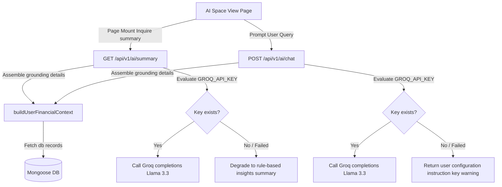

# Grounded AI Space Implementation Walkthrough

We have designed, built, and E2E tested the MERN-based **FinIntel AI Space Module** using Groq's active `llama-3.3-70b-versatile` reasoning model.

---

## 🛠️ System Design

---

## 📂 Implementation Details

### 1. Data Grounding & Prompt Templating (`/server`)
- **Telemetry Context Aggregator (`/utils/contextBuilder.js`)**:
  - Compiles user database context (asset account balances, periodic income/expense flows, spending anomalies, active budgets, percent utilization details, upcoming loan EMIs) into a unified JSON schema.
- **LLM Connectivity (`/services/aiService.js`)**:
  - Pours messages directly into `https://api.groq.com/openai/v1/chat/completions` using native fetch headers, targeting the `GROQ_MODEL=llama-3.3-70b-versatile` variables setup. Set standard low temperature (`0.1`) to ensure strict factual containment.
- **AI Handlers (`/controllers/aiController.js`)**:
  - `GET /summary`: Instructs the LLM using a strictly bounded system format to summarize details in exactly 3-5 sentences. Fallback routines gracefully degrade to rule-based insights in case of key misconfigurations or server limits.
  - `POST /chat`: Attaches system directives to enforce database boundaries:
    1. Answers only using the grounding context.
    2. Answers queries outside known details with: *"I do not have data on that to comment."*
    3. Handles affordability queries (such as vehicle loans, accessories budgets) by evaluating net savings and upcoming EMIs.

### 2. Splitted Frontend View Hub (`/client/src/pages/AISpace.jsx`)
- **Active Reports sidebar (Left)**: Instantly fetches context stats on mount. Shows summary cards, AI summaries, and telemetry insights.
- **Chat Space Interface (Right)**: Shows user vs agent message bubbles. Supports conversation history persistence in React state and provides one-click chat presets.
